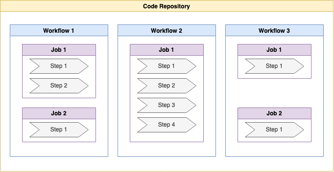

# GitHub Actions

Repository with the exercises used while learning GitHub Actions

## What are GitHub Actions?

It's a workflow automation service, provided by GitHub, that automates all kinds of repository-related processes and actions.

## Key Elements

The following image is a general overview of the structure and the key elements of GitHub Actions, with the description of each one of them below.

### Workflows

- Workflows are attached to GitHub repositories.
- These can be added to any GitHub repository and add as many workflows as wanted.
- Triggered uppon _events_.

### Jobs

- A workflow includes one or more jobs.
- Defines a **Runner** (execution environment).
- Contain one or more steps.
- Run in parallel (default) or sequential.
- Can be conditionally triggered.

### Steps

- Jobs contain one or more steps that will be executed in the order where they're specified.
- These steps define the actual things that will be done.
- The steps execute a **shell script** or an **Action**.
- Can use custom or third-party actions.
- Steps are executed in order.
- Can be conditional.

## Definitions

<dl>
  <dt>Continuous Integration (CI)</dt>
  <dd>Code changes are automatically build, tested and merged with existing code.</dd>

  <dt>Continuous Delivery (CD)</dt>
  <dd>After integration, new app or package versions are published automatically.</dd>
</dl>
